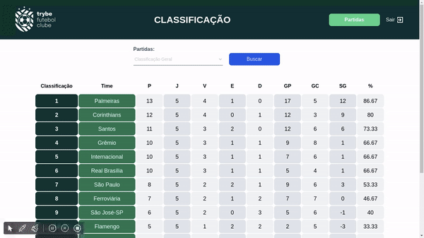

# Trybe Futebol Clube

Projeto de integração onde fomos provocados a criar todo "back-end" utilizando a biblioteca "express" com “TypeScript”, e colocando em prática os conhecimentos em POO e SOLID.

O projeto conta com um Front-End onde você pode listar uma tabela de times, fazer login para ter acesso como administrador e poder editar as partidas, e Tela de filtragem de dados!

Nossa função foi fazer a integração do front com o back-end e desenvolver testes TDD para construção do mesmo!

## Aprendizados

O Maior desafio deste projeto foi construir o "setup" pois já tinha conhecimento do express apenas na utilização funcional, e para fazer ele com "Class" tive que fazer muitas buscas na internet recorrer a colegas de turma e monitorias, até que consegui achar um solução onde eu compreendesse sua manipulação e eu pudesse dar seguimento!

* Habilidades desenvolvidas nesse projeto foram:
* Comunicação, principalmente feedback e pedir ajuda!
* Colaboração
* Pensamento Crítico
* Criatividade para resolver os problemas
* Raciocínio Lógico.

## Prévia



## Instalação

 Banco de dados:

Tem o papel de fornecer dados para o serviço back-end. Durante os testes sempre vai ser acessado pelo sequelize e via porta 3002 do localhost;
O projeto contém um script db:reset para resetar o banco de dados, criando este e rodando as migrations e seeders. Você pode usá-lo em app/backend com o commando npm run db:reset;
Já existem seeders prontas em app/backend/seeders. Quando acabar de fazer uma migration você deve renomear a seeder retirando o underline (_) ao fim dela, assim o script db:reset vai usá-la nos testes e você testará sua migration.
two Back-end:

Deve rodar na porta 3001, pois o front-end faz requisições para ele na porta 3001 por padrão;
Sua aplicação deve ser inicializada a partir do arquivo app/backend/src/server.ts;
Garanta que o express é executado e a aplicação ouve a porta que vem das variáveis de ambiente;
Todas as dependências extras (tal como joi, boom, express-async-errors...) devem ser listadas em app/backend/packages.npm.
three Front-end:

Todos os testes a partir do requisito de login usam o puppeteer para simular uma pessoa acessando o site http://localhost:3000/;
Esse site faz requisições para o back-end na porta 3001 para acessar e modificar os dados do banco através dos endpoints que você deve construir nos requisitos.
four Docker:

O Docker entra com o papel de unir todas as partes e subir um projeto completo com um comando só via o docker-compose;
Você deve configurar as Dockerfiles nas raízes do front-end e back-end, copiando os arquivos para a imagem, instalando as dependências e inicializando a aplicação;
Seu projeto deve ter um arquivo app/docker-compose.yml (você pode criá-lo a partir do app/docker-compose.example.yml), você deve garantir que no arquivo:
O container_namedo serviçoback-endé nomeado comoapp_backend`;
O banco de dados tem sua porta do container 3306 mapeada para as 3002 do localhost;
O serviço front-end tem a porta 3000 do container mapeada para a porta 3000 do localhost.

## Rodando localmente

Clone o projeto

```bash
  git clone git@github.com:rafaelsantosmg/trybe-futebol-clube-back-end.git
```

Entre no diretório do projeto

```bash
  cd trybe-futebol-clube-back-end
```

Instale as dependências

```bash
  npm install
```

Certifique de ter o docker e docker-compose instalado em sua maquina se precisar de ajuda com a instalação pode seguir a documentação para o mesmo!

Execute o comando

```bash
  npm run compose:up
```

Se todos os conatiners subir com sucesso basta acessar em seu navegador com caminho "http://localhost:3000/" e tudo pronto!
